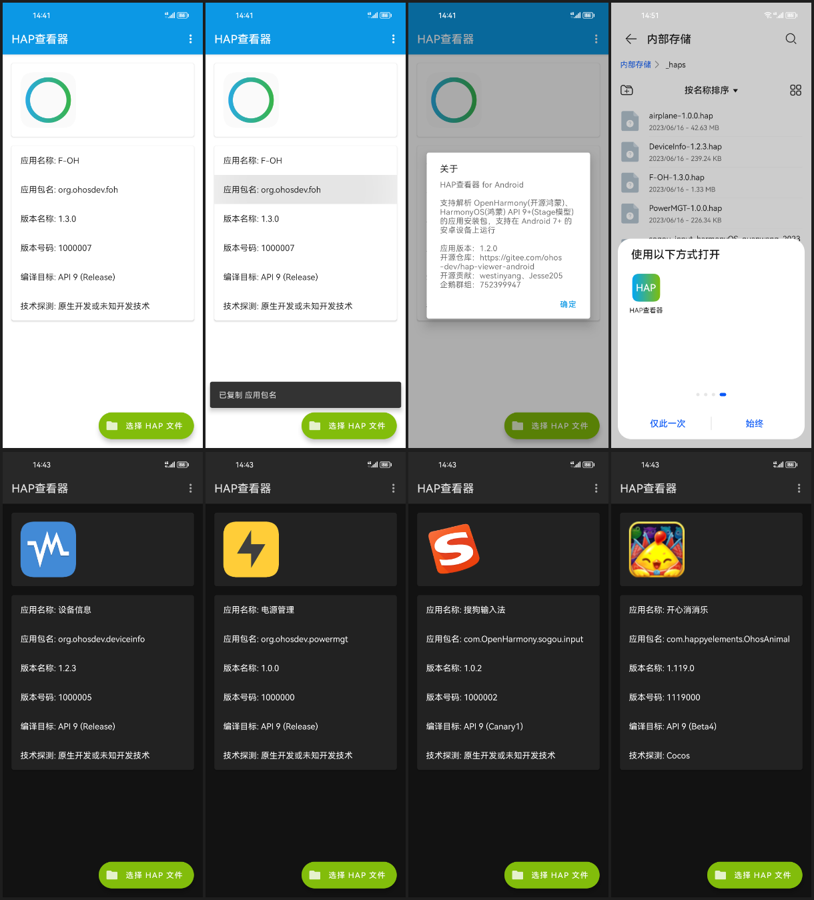

# HapViewerAndroid

## 项目介绍

安卓版的hap查看器，支持解析 OpenHarmony(开源鸿蒙)、HarmonyOS(鸿蒙) API9+(Stage模型) 的应用安装包，支持在 Android 7+ 的安卓设备上运行

开源仓库

- [Gitee](https://gitee.com/ohos-dev/hap-viewer-android)
- [Github](https://github.com/ohos-dev/hap-viewer-android)

### 系列项目

- 电脑版（跨平台）：[ohos-dev/hap-viewer](https://gitee.com/ohos-dev/hap-viewer)
- **手机版（Android）**：[ohos-dev/hap-viewer-android](https://gitee.com/ohos-dev/hap-viewer-android)

## 下载安装

- https://gitee.com/ohos-dev/hap-viewer-android/releases
- 酷安（即将上架）...

## 开发环境

- Android Studio 2022.1.1

## 截图预览

## 视频演示

- https://www.bilibili.com/video/BV1pX4y147V8

## 许可声明

- 本项目是以Apache2.0许可开源，如果衍生或商用需保留原始版权和许可声明即可
- 使用的开源软件
  - [Material Components for Android](https://github.com/material-components/material-components-android) `Apache-2.0 license`
  - [Android Jetpack](https://github.com/androidx/androidx) `Apache-2.0 license`
  - [AndroidFastScroll](https://github.com/zhanghai/AndroidFastScroll) `Apache-2.0 license`
  - [Pictogrammers Material Design Icons](https://pictogrammers.com/library/mdi/) `Apache-2.0 license`

## 开源贡献

> HapViewerAndroid 项目由 westinyang 创建于 2023 年，并获得包括但不限于以下人士的贡献：

- [westinyang](https://gitee.com/westinyang)
- [Jesse205](https://gitee.com/Jesse205)
